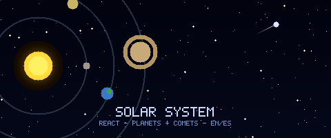

<div align="center">
  

  [](https://reactjs.org/)
  [](https://reactrouter.com/)
  [](https://developer.mozilla.org/en-US/docs/Web/JavaScript)

  **🪐 Explore the solar system — planets, dwarf planets, comets, and meteors — in English and Spanish 🌍**

</div>

---

## ✨ Features

- 🌍 **Bilingual** — full content in English and Spanish
- 🪐 **All object types** — planets, dwarf planets, asteroid belt, comets, meteors
- 📄 **Detail pages** — individual route per object via React Router
- 🖼️ **Custom illustrations** — unique image for each body

## 🚀 Quick Start

```bash
npm install
npm start
```

Open `http://localhost:3000`.

## 🏗️ Build

```bash
npm run build
```

## 🛠️ Tech Stack

- **React 16**
- **React Router v5** — client-side routing per solar body
- **Create React App**
- JSON data files in `public/data/` for EN and ES content
